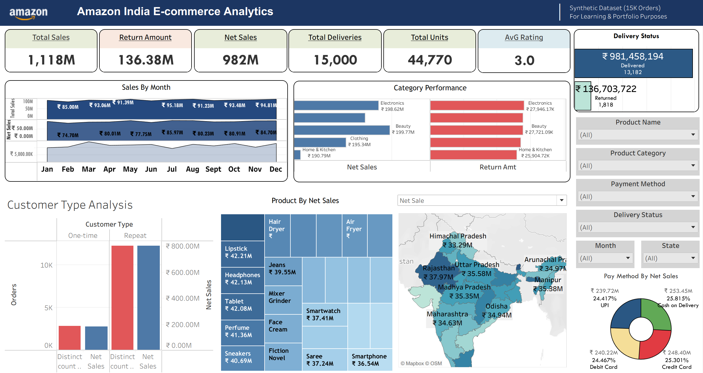

# Amazon India Sales Analytics — SQL & Tableau

An end-to-end sales analytics project using **MySQL and Tableau** to analyze customer behavior, sales performance, product performance, returns, payment methods, and regional performance using a synthetic Amazon India sales dataset.

The project combines SQL-based analysis with an interactive Tableau dashboard to transform raw transactional data into business-focused insights.

---

## 📊 Dashboard Preview



> Interactive Tableau dashboard covering sales KPIs, monthly performance, category and product analysis, customer types, payment methods, delivery status, and state-level performance.

---

## 🎯 Project Objective

The objective of this project is to analyze an e-commerce sales dataset and answer key business questions around:

- Overall sales and revenue performance
- Monthly sales trends
- Product and category performance
- Customer purchasing behavior
- One-time vs repeat customers
- Average Order Value (AOV)
- Returns and delivery status
- Payment method performance
- State-wise sales performance
- Product ratings and reviews

The analysis was performed using **MySQL**, while **Tableau Public** was used to build the final interactive dashboard.

---

## 🗂️ Dataset

The project uses a **publicly available synthetic Amazon India sales dataset**.

### Dataset Details

| Attribute | Details |
|---|---|
| Dataset | Amazon Sales 2025 |
| Records | 15,000 orders |
| Customers | 7,259 |
| Period | January 2025 – December 2025 |
| Country | India |
| Categories | 5 |
| Dataset Type | Synthetic |
| Format | CSV |

### Main Fields

- `Order_ID`
- `Date`
- `Customer_ID`
- `Product_Category`
- `Product_Name`
- `Quantity`
- `Unit_Price_INR`
- `Total_Sales_INR`
- `Net_Sales_INR`
- `Payment_Method`
- `Delivery_Status`
- `Extra_Charges`
- `Return Amount_INR`
- `Review_Rating`
- `Review_Text`
- `State`
- `Country`

The original `Date` field was stored as text in `DD-MM-YYYY` format. A proper `Order_Date` field was created in MySQL for time-based analysis.

---

## 🛠️ Tools & Technologies

- **MySQL** — data cleaning, validation, analysis, and business queries
- **Tableau Public** — interactive dashboard and visualization
- **SQL** — aggregations, customer segmentation, KPIs, and performance analysis
- **CSV** — data storage and Tableau data source

---

## 🔄 Project Workflow

```text
Raw CSV Dataset
       ↓
    MySQL
       ↓
Data Validation & Cleaning
       ↓
Exploratory & Business Analysis
       ↓
     SQL Views
       ↓
      CSV
       ↓
   Tableau Public
       ↓
Interactive Dashboard
